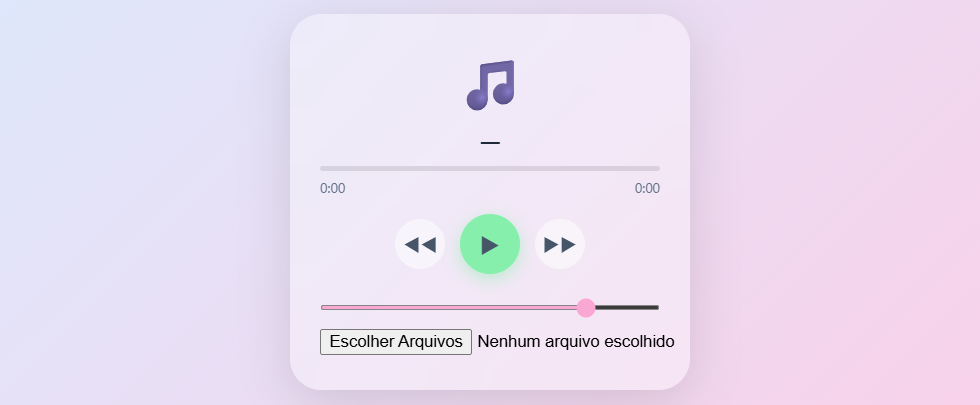

**🎵Player**

Este foi um grande desafio. Queria um player de música super simples para não ter que me preocupar. Então, comecei a desenvolver esse pensando em diferentes problemáticas, coisas até novas pra mim como XSS, magic bytes, createObjectURL e etc. Este foi o resultado. Desafiador, mas com um gostinho do que eu queria - só algo pra ouvir música e que seja simples.

💊 Gosto de fazer essas soluções rápidas quando me deparo com alguma necessidade e não quero gastar dinheiro ou me registrar em alguma plataforma. <b>Sem internet, sem cadastro, só um software não corporativista.</b> E você pode me ajudar indo lá no https://livepix.gg/caindev e dar uma forcinha e/ou ideia para um novo projeto.
